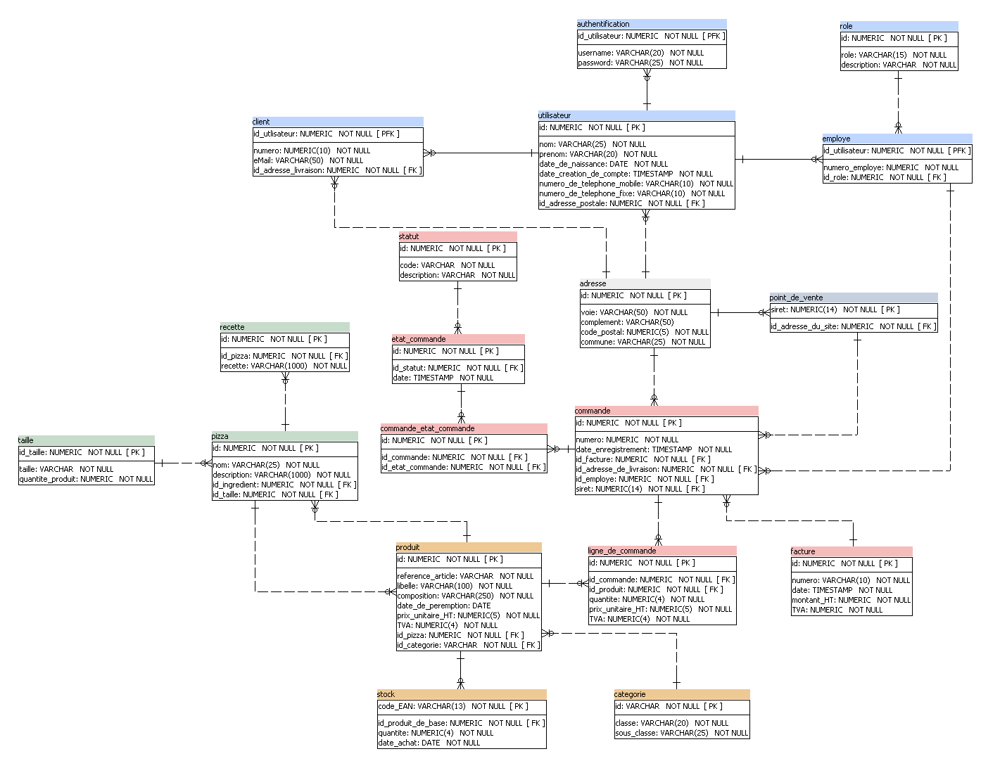

# PROJET 5 - Concevez la solution technique d’un système de gestion de pizzeria 
____  

## Diagramme de Classe

1. La première étape consiste à mettre en forme les classes et les attributs. A l'aide d'éclipse, je développe un système cohérent pour la gestion de la pizzeria.  
  &nbsp;
2. Sur éclipse je télécharge et installe le plug-in "ObectAid" qui sert à générer diagramme de classe à partir d'un projet existant :  
	- Etape 1 :  
	dans le menu éclipse, je vais dans l'onglet 'Help' et sélectionne 'Install New Software'  
  &nbsp;
	  
  &nbsp;
	- Etape 2 :  
	je clique sur le bouton 'add'  
	  
	- Etape 3 :  
	je copie les informations suivante et appuye sur 'ok'  
	Name: ObjectAidUML Explorer  
	URL: http://www.objectaid.com/update/current  
	  
	- Etape 4 :  
	je selectionne ce que je veux installer et appuye sur le bouton 'next', puis j'attends que le programme s'installe.
  &nbsp;  
	
  &nbsp;
  &nbsp;
	- Etape 5 :  
	j'accepte la license et appuyez sur 'finish'.  
  &nbsp;
	  
  &nbsp;
	- Etape 6 :  
	un message d'erreur s'affiche 'Security Warning', je presse 'OK'. Le plug-in est installé et prêt à fonctionner.  
  &nbsp;
3. Dans l'onglet 'File', je fais 'New', puis 'Other'. Je cherche le dossier "ObjectAid UML Diagram", puis sur 'ObjectAid Class Diagram' et je fais 'NEXT. 
Je donne un nom à mon Diagramme et je fais 'FINISH'. 
  &nbsp;
4. Une fois dans le fichier du diagramme, je déplace les classes que je souhaite mettre dans celui-ci. Le diagramme est créé.
  &nbsp;
5. Je créé sur le logiciel "Visio" un diagramme à partir de celui d'Eclipse. Celui-ci est plus complet et plus présentable.
  
 	&nbsp;

## Modèle Physique de Données

1. La première étape consiste à partir du diagramme de classe que l 'on vient de finir, d'élaborer le modèle physique de données sommairement à l'aide du logiciel "Power Architect".  
	 &nbsp;
2. J'ajoute ensuite les différentes clés primaires et étrangères de chaque table.  
	&nbsp;
3. J'obtiens le résultat suivant :

