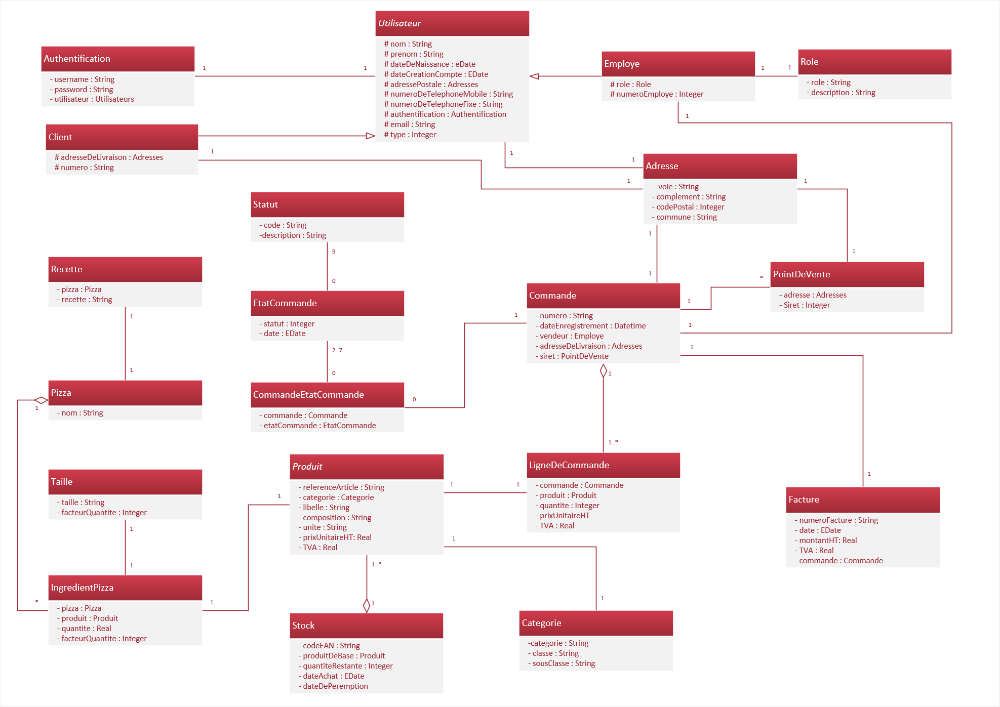
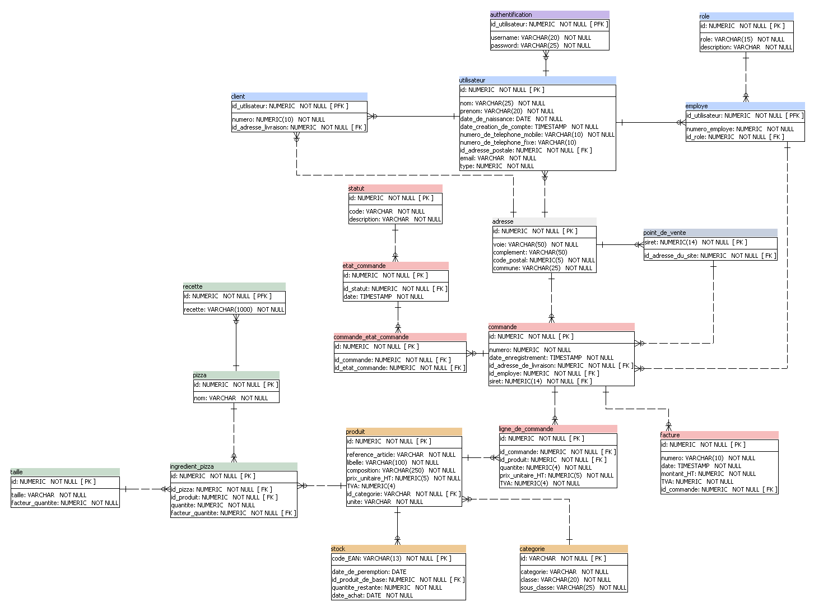
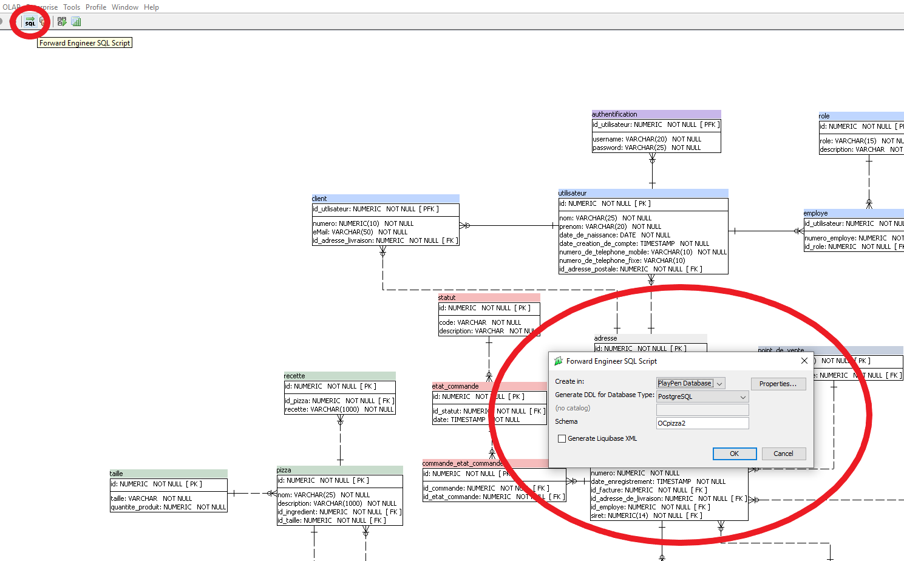
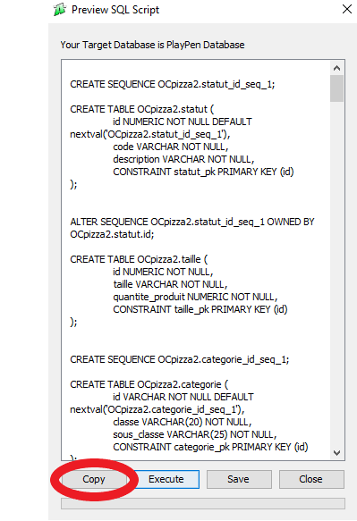
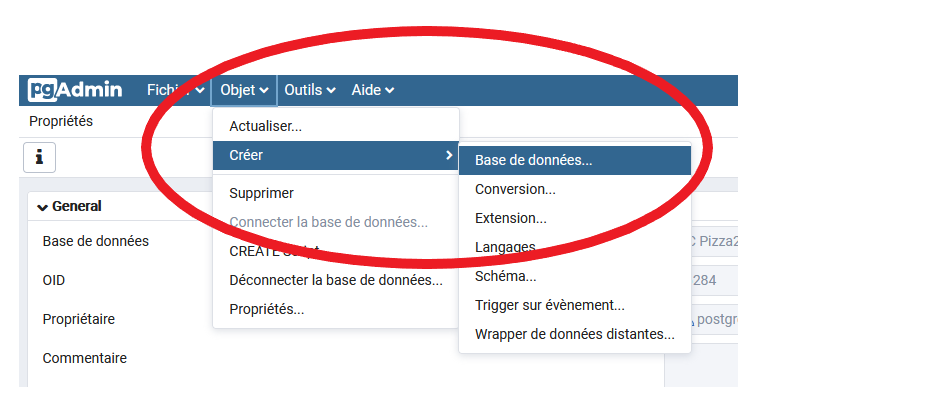
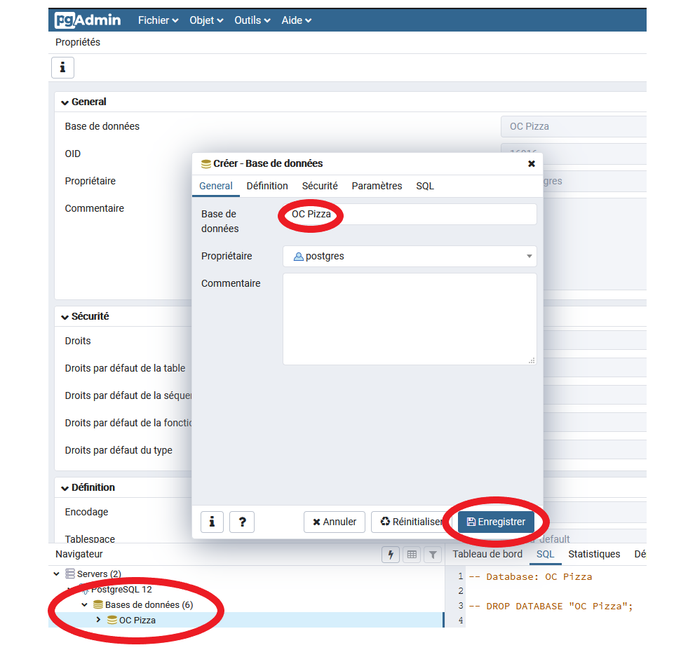
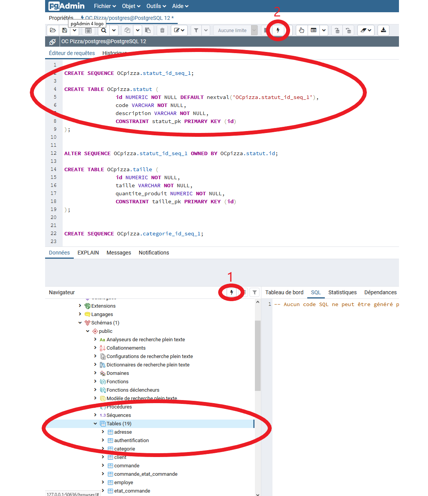
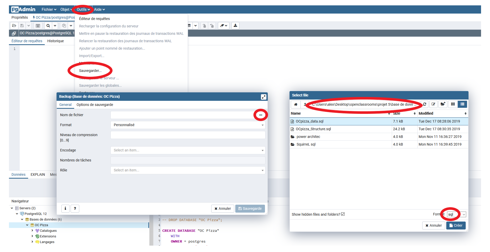
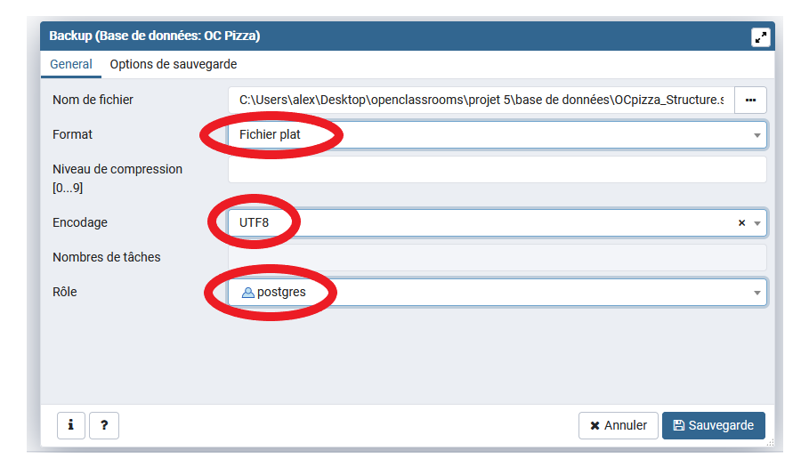

# PROJET 5 - Concevez la solution technique d’un système de gestion de pizzeria 
____  

## Diagramme de Classe

1. La première étape consiste à mettre en forme les classes et les attributs. A l'aide d'éclipse, je développe un système cohérent pour la gestion du groupe "OC Pizza" que je code à l'aide du langage JAVA.  
  &nbsp;
2. Sur éclipse je télécharge et installe le plug-in "ObectAid" qui va me servir à générer un diagramme de classe à partir de mon projet :  
	- Etape 1 :  
	dans le menu éclipse, je vais dans l'onglet 'Help' et sélectionne 'Install New Software'  
  &nbsp;
	  
  &nbsp;
	- Etape 2 :  
	je clique sur le bouton 'add'  
	  
	- Etape 3 :  
	je copie les informations suivante et appuye sur 'ok'  
	Name: ObjectAidUML Explorer  
	URL: http://www.objectaid.com/update/current  
	  
	- Etape 4 :  
	je selectionne ce que je veux installer et appuye sur le bouton 'next', puis j'attends que le programme s'installe.
  &nbsp;  
	
  &nbsp;
  &nbsp;
	- Etape 5 :  
	j'accepte la license et appuyez sur 'finish'.  
  &nbsp;
	  
  &nbsp;
	- Etape 6 :  
	un message d'erreur s'affiche 'Security Warning', je presse 'OK'. Le plug-in est installé et prêt à fonctionner.  
  &nbsp;
3. Dans l'onglet 'File', je fais 'New', puis 'Other'. Je cherche le dossier "ObjectAid UML Diagram", puis sur 'ObjectAid Class Diagram' et je fais 'NEXT. 
Je donne un nom à mon Diagramme et je fais 'FINISH'. 
  &nbsp;
4. Une fois dans le fichier du diagramme, je déplace les classes que je souhaite mettre dans celui-ci. Le diagramme est créé.
  &nbsp;
5. Je créé sur le logiciel "Visio" un diagramme à partir de celui généré sur Eclipse. Celui-ci est plus complet et plus présentable.  
	&nbsp;  
  
	&nbsp;  

## Modèle Physique de Données

1. La première étape consiste à partir du diagramme de classe que l 'on vient de finir, d'élaborer le modèle physique de données sommairement à l'aide du logiciel "Power Architect".  
	 &nbsp;
2. J'ajoute ensuite les différentes clés primaires et étrangères de chaque table.  
	&nbsp;
3. J'obtiens le résultat suivant :  
  
	&nbsp;  

## Création de la Base de Données
1. Dans "Power Architect", je génère la base de données à partir de mon modèle physique de données, en cliquant sur l'icone SQL situé en dessous du menu 'enterprise'.  
	 &nbsp;  
  
	 &nbsp;  
2. Ensuite je copie le code crée en SQL, à l'aide du bouton "Copy".  
	&nbsp;  
  
	&nbsp;  
3. Je me connecte dans "pgAdmin4" et je crée une nouvelle base de données.
	&nbsp;  
  
	&nbsp;  
4. Je rentre le nom de ma base de données, je l'enregistre, et ma base de données apparait dans le navigateur.  
	&nbsp;  
  
	&nbsp;  
5. Je clique sur l'icone éclair(1), la partie 'Editeur de requêtes' s'affiche. Je colle le code crée en SQL sur "Power Architect" dans cette partie et valide à l'aide de l'icone éclaire(2). Les tables du groupe "OC Pizza" sont maintenant dans la base données.
	&nbsp;  
	
  
	&nbsp;  
	
## Sauvegarder un Schéma ou des données
1. Dans pgAdmin4, je selectionne 'Outils' dans la barre de menu, puis 'Sauvegarder' dans le menu déroulant. Je vais commencer par sauvegarder le schéma.
2. La fenêtre Backup s'affiche, dans l'onglet 'General', je clique sur le nom de fichier et donne un nom à mon fichier en s'assurant de mettre l'extension .sql à la fin.  
	&nbsp;  
  
	&nbsp;  
3. De retour dans la fenêtre backup, je mets le type de format sur 'Fichier plat', l'encodage sur 'UTF8' et le rôle sur 'postrgres'.  
	&nbsp;  
  
	&nbsp;  
4. Je sélectionne ensuite l'onglet 'Options de sauvegarde'. Je mets le type 'Shéma uniquement' sur 'yes et laisse le 'Blobs' sur 'yes' également. Dans la section requête je met également sur 'yes' tout ce qui concerne les commandes INSERT. Une fois toute les étapes effectuées, je clique sur 'Sauvegarde
	&nbsp;  
  
	&nbsp;  
5. La sauvegarde de mon schéma est crée. Je répète le même processus pour les données, en retirant juste le type 'Shéma uniquement' et en mettant à la place 'Données uniquement' sur 'yes' dans 'Options de sauvegarde'.